# Mini Store 商城 H5 适配检查

检查日期：2026-09-21。对象：`http://127.0.0.1:5174`，前端提交 `d4bcfae`，包含检查开始时已经存在的 `src/ux.css` 搜索焦点样式改动。

## 结论

已实现基础响应式布局，但尚不能作为完整的移动端验收通过。优先问题是注册表单被裁切、长搜索词撑破页面、窄屏分页排版；其次是小字号、小点击区域和平板断点。此次只做检查和报告，没有修改应用源码，也没有创建账户、提交订单或修改业务数据。

当前浏览器未登录。购物袋和结算只验证了未登录入口；订单、资料、地址和评价弹窗只检查源码，不能算登录后运行验收通过。已经询问可用测试账号，报告生成时尚未收到回复。

## 检查方法与范围

- 在 Codex 内置浏览器检查当前真实前端与后端，不使用旧截图作结论。
- 首页、商品列表、商品详情测量 320、375、390、430、760、761、768、820、1024、1440 CSS 像素宽度。
- 收藏、购物袋未登录页、结算未登录页、登录页测量 320、390、768、1024 宽度；注册另测 320、390、768。
- 重点截图检查手机 320/390、平板 768；不是所有宽度都逐屏截图。
- 检查文档宽度、网格、字体、控件尺寸，实际操作规格、数量、下拉、排序、分页、帮助折叠与结算登录返回链接。
- 响应式浏览器模拟不等于 iOS Safari / Android Chrome / 微信 WebView 真机测试。软件键盘、浏览器工具栏伸缩、安全区、真实触摸惯性和系统字体放大尚未验收。
- 尝试发送触摸滑动时，内置浏览器不支持该操作，因此不声称品牌菜单通过真实触屏滚动测试。
- 主要页面的正常种子商品内容在上述尺寸未发现整页横向溢出。注册表单存在被 `overflow: hidden` 掩盖的内部溢出，所以整页宽度检查不能替代截图。
- 本轮浏览器日志读取未见 warning/error；已有 8 项 Node 测试通过。这些测试主要覆盖数据映射和选择键盘逻辑，不证明移动布局正确。

## 已确认问题（按优先级）

| 编号 | 优先级 | 问题与影响 | 当前证据 | 建议 |
|---|---|---|---|---|
| H5-01 | P1 | 注册页右侧姓名输入框、说明和注册按钮被裁切，无法完整看到要填写和提交的内容 | 320px 下卡片宽 284px，表单宽 358px，右侧到 x=401；外层 `overflow:hidden`。390px 同样裁切，见步骤 6 | 修复共用表单：Grid 列允许收缩、子项 min-width 为 0、输入框占满所属列；手机改成单列，同步调整 span-two。不要用隐藏横向溢出来掩盖 |
| H5-02 | P1 | 连续英文/数字搜索词撑破整页，商品数量与标题右侧内容被推出屏幕 | 输入约 60 字符的无空格测试词，320/390px 页面 scrollWidth 均约 957px；h1 宽约 881px，见步骤 3 | page-intro 的文字区域允许收缩，长词可断行，件数不被挤走；验证长 SKU、长品牌与中文搜索 |
| H5-03 | P2 | 小屏分页的“上一页/下一页”逐字竖排，并越出 36px 按钮高度 | 320px，7 个最小 36px 按钮加 6×9px 间距至少 306px，内容区只有 284px，见步骤 4 | 移动端只显示上一页、当前页/总页数、下一页；给文字按钮实际所需宽度和足够点击高度 |
| H5-04 | P2 | 翻页后仍停在列表底部，用户看不到新一页开头 | 点击下一页后激活页码为 2、首个商品已换，但 scrollY 仍约 1274，商品网格顶部在视口上方约 651px，见步骤 4 | 数据更新成功后滚动至结果标题，并处理键盘焦点与读屏结果播报；不能只切换数组 |
| H5-05 | P2 | 手机整体字号偏小，长日文商品名和辅助信息阅读吃力 | 搜索输入 11px；商品名 12px；品牌/评分/含税说明 9px；分类说明 9px；见步骤 1、2、5 | 正文/商品名优先 14–16px，辅助信息 12–13px，输入框建议 16px；用布局调整容纳信息，避免整体缩小 |
| H5-06 | P2 | 高频操作目标偏小，触屏容易点错 | 头部收藏/账户/购物袋 32×32px，商品收藏 28×28px，搜索按钮约 36×20px，分类按钮约 31px 高 | 高频独立按钮建议至少 44×44px 交互区域，可保留较小图标。下拉选项现有 44px 高度较好；此处不是完整 WCAG 合规判定 |
| H5-07 | P2 | 登录表单标签与输入框混在同一行，输入行没有垂直间距，字段宽度没有适配卡片 | 手机和平板邮箱/密码输入均约 173px 宽、14px 字，两个输入边缘相接，见步骤 6 | 把 label、输入框、间距定义为共用表单样式；当前完整表单样式仅在 `.modal` 内生效，登录和资料复用 `.form-grid` 却没得到同样样式 |
| H5-08 | P2 | 761–820px 平板区域直接套桌面布局，内容局部拥挤 | 760→761px 首页商品从两列突变四列；768px 首页“样子”被断成“样 / 子。”；商品详情加入购物袋按钮换两行，见步骤 1、5 | 增设平板布局策略：调整 hero 文案宽度/字号、合适网格列数，购买按钮独立成行或让购买区更宽。按内容能否容纳确定断点 |
| H5-09 | P2 | 品牌菜单无可输入的筛选框，151 个选项在手机上查找成本高 | 菜单约 280px 高、总滚动内容约 6956px；可用 End/Enter 键选中 Yui Works，但这是实体键盘能力，见步骤 2 | 优先在品牌菜单加入搜索输入和清除入口；按需采用手机弹层，不必全站重做选择器 |

P1 表示会明显妨碍填写/浏览；P2 表示可继续使用，但影响阅读或操作效率。没有把纯风格偏好列为严重故障。

## 逐页过程与截图

### 1. 首页与公共导航：基础可用，平板排版和手机字号待改善

手机头部搜索独立一行，主导航可横向容纳多个分类，首页商品在手机采用两列。768px 的 hero 标题出现单字残行；四列分类卡片较密。导航隐藏滚动条且没有明显滑动提示，可以优化后续分类的可发现性。

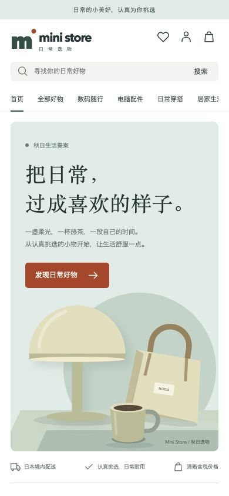

### 2. 商品列表、品牌、排序：能操作，但筛选占高、文字与触控目标偏小

商品数据真实加载。320px 下首件商品约到页面 y=623 才出现；筛选始终全部展开，挤占小屏首屏。390px 品牌菜单可展开且留在屏幕范围内，选择项有选中态；End/Enter 可选最后品牌，Escape 可关闭。排序可切换为价格从低到高并更新 URL 的 sort 参数。实体键盘交互已验证，真实手指惯性滚动未验证。

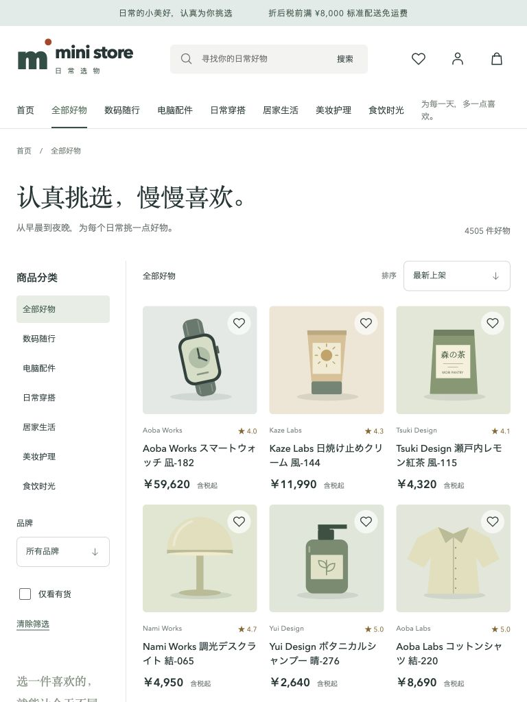
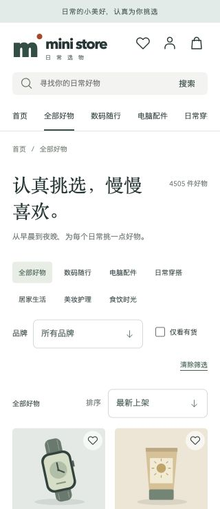
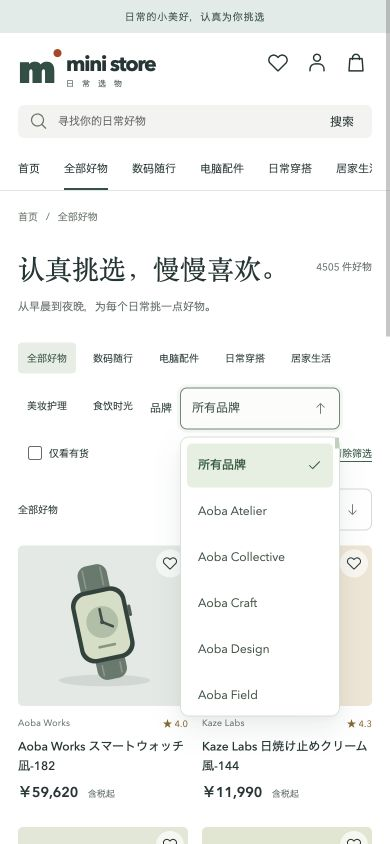

### 3. 搜索与无结果状态：普通输入可用，长词布局失败

复现输入：`H5AuditLongUnbrokenProductKeyword123456789012345678901234567890`。页面成功展示无结果状态，但标题不换词导致内容宽度约 957px。应验证的是所有动态文本容器，不只给这条测试字符串特判。

### 4. 商品分页：320px 排版失败，翻页后阅读位置不合理

下一页确实更新了商品和页码，但仍停在页面底部。截图显示“上一页/下一页”文字超过按钮底边。这一类问题需要交互验证，查看第一页首屏发现不了。

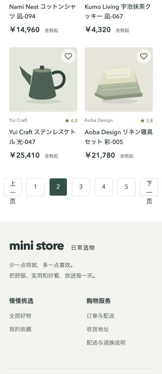

### 5. 商品详情：规格与数量有效，平板购买区拥挤

切换 Black→White 后，价格由 ¥59,620 变为 ¥65,582，可售库存由 82 变为 103；增加数量后显示 2。手机采用图文上下布局，购买按钮没有越出正常页面；768px 两列详情将加入购物袋按钮挤成两行。未执行实际加购或下单。

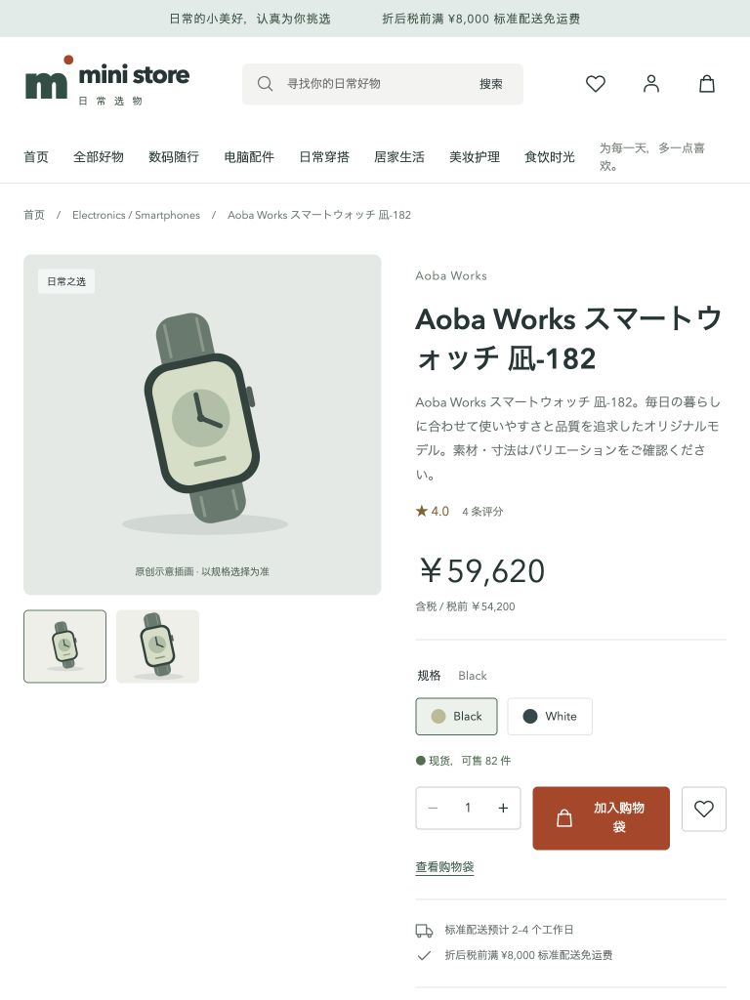
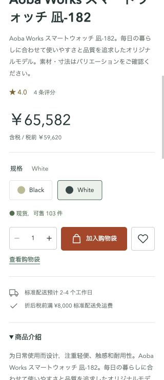

### 6. 登录与注册：登录可见但排版粗糙，注册裁切需优先修复

登录表单输入宽度没有随父容器伸缩。切换注册后双列姓名字段撑大 Grid，父级隐藏溢出，造成输入、说明、提交按钮被裁掉。本轮未填写凭据或提交注册。

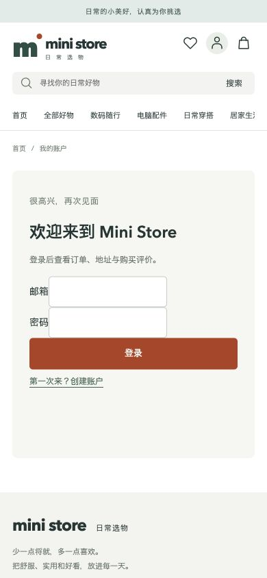
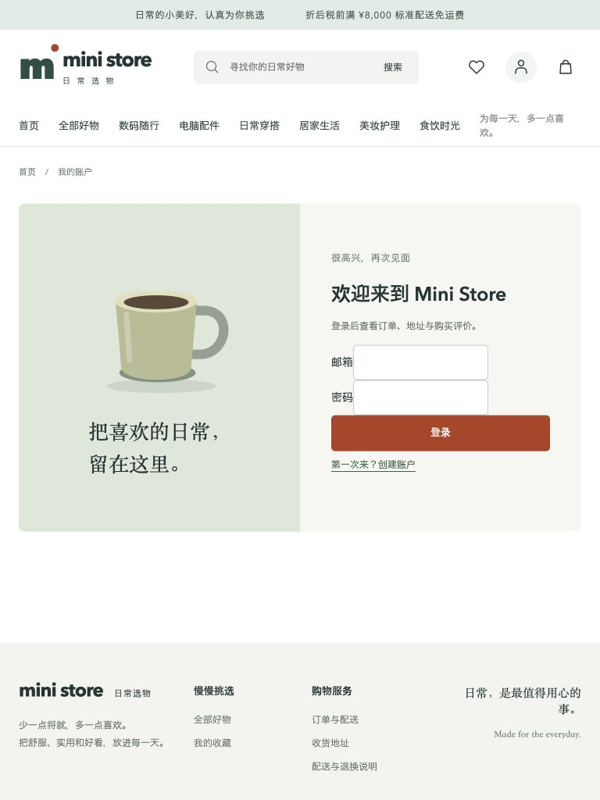
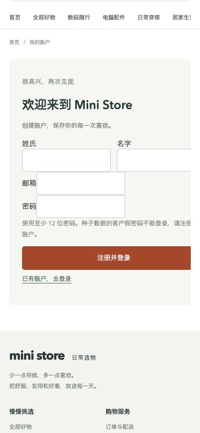
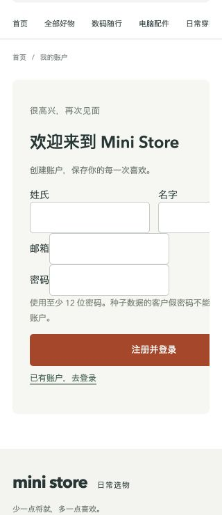

### 7. 收藏：空状态可用，空列表仍显示全部筛选有冗余

当前没有收藏。空状态有明确入口“去发现好物”；仍显示品牌、分类、排序，占用手机首屏，可在真正空收藏时收起这些控件。没有写入或删除用户收藏。

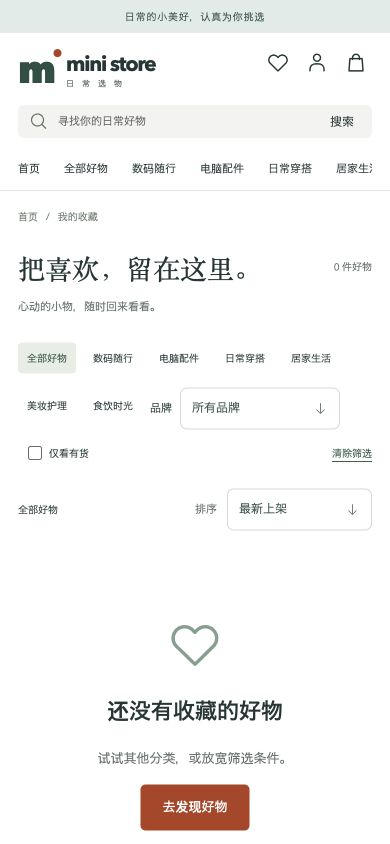

### 8. 购物袋与结算：未登录引导通过，完整购物流程待账号验证

两页在 320/390/768/1024 下没有发现整页横向溢出。结算的登录链接保留 `next=/checkout`。已登录购物袋商品行、优惠券错误、配送切换、订单预览与提交未实测。

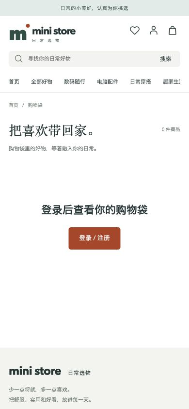
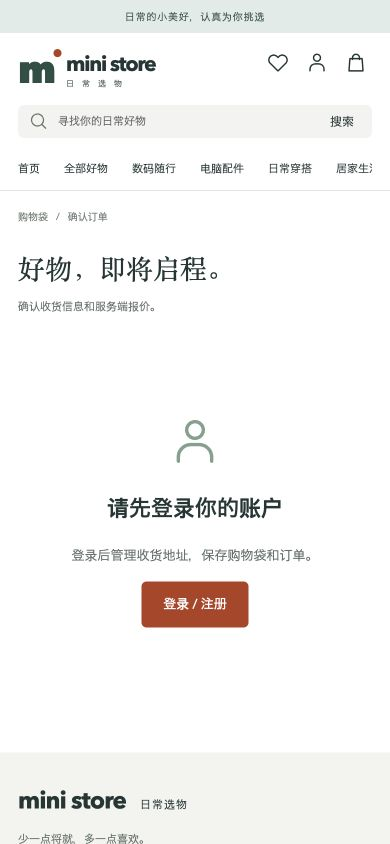

### 9. 帮助说明：基本可用

320px 下段落可换行，折叠的“账户与个人资料”可展开，返回挑选入口存在。文字偏小的问题与全局一致。

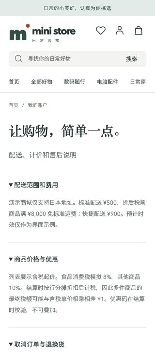

### 10. 资料、地址、订单、评价：源码审查，运行验收未完成

- 个人资料复用相同 `.form-grid`，可能受到登录/注册同类尺寸与标签样式问题影响，需要登录后截图确认。
- 地址弹窗在手机仍保持双列；`max-height:88vh` 与 `overflow-y:auto` 只能说明允许滚动，无法证明软键盘弹出后提交按钮、关闭按钮仍可见。
- 订单时间线有横向滚动；应以多状态、长订单号、长物流号和多商品数据检查。
- 购物袋数量按钮在手机 CSS 中是 28px；作为频繁触屏操作建议扩大交互区域。
- `MotionDialog` 使用原生 dialog、支持 Escape，并有 reduced-motion 分支；实际焦点回归、Tab 限制、软键盘和背景滚动仍需打开弹窗验证。
- 评价提交、支付成功/失败、取消确认未执行；没有把这些标为通过。

## 已确认的基础能力

- viewport meta 没有禁止用户缩放，页面声明 `lang=zh-CN`。
- 多数商品网格使用 `minmax(0,1fr)`，正常长日文商品名能够换行。
- 公开页面的主要跳转、规格选择、数量调整、排序与帮助折叠正常。
- 开启减少动态效果模拟后，商品名下划线及收藏按钮计算样式的 transitionDuration 均为 0s；已恢复模拟设置。
- 搜索、图标链接、数量按钮、自定义选择器有可访问名称；自定义选择器有展开态与选中态。这不是完整读屏或无障碍合规测试。

## 源码定位

- `src/Account.vue`：登录/注册 form-grid（约 281 行），个人资料（约 534 行），地址弹窗（约 635 行）。
- `src/style.css`：page-intro（约 750 行）、分页（约 854 行）、login-panel（约 1557 行）、modal / form-grid（约 1609 / 1646 行）。
- `src/style.css`：1100px 与 760px 媒体查询（约 1691 / 1763 行）；手机字体、收藏按钮、数量按钮集中在 760px 分支。
- `src/Catalog.vue`：watch(page, load)（114 行）及分页（226 行），没有加载成功后回到结果顶部的处理。
- `src/components/StoreSelect.vue` 与 `src/ux.css`：品牌选择器、菜单定位、键盘支持及交互尺寸。

## 建议实施顺序与验收条件

1. 先修共用表单与长文本容器：320/375/390/430/768 均能完整填写注册、资料和地址，任何字段/按钮不被裁切；长搜索词不产生整页横向滚动。
2. 修移动分页：文字不溢出，点击区域易点；切到下一页能看到新结果顶部。
3. 统一手机字号和交互尺寸：输入建议 16px，正文/商品名 14–16px，辅助文字尽量不低于 12px，常用独立按钮至少提供约 44px 点击区域。
4. 补平板断点：761/768/820 下标题无单字残行、商品详情购买按钮完整、网格密度合理。
5. 登录有订单的测试账号，补购物袋→结算→订单、资料、地址与评价弹窗实测，再进行 iOS/Android 真机软键盘、横屏和缩放验收。

原始尺寸测量见 [viewport-measurements.json](viewport-measurements.json)。该文件记录布局采样，截图与交互结果才是视觉问题的主要证据。
