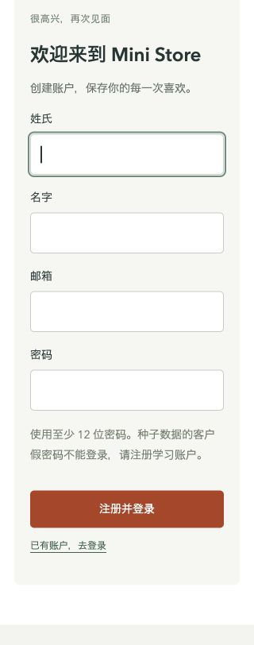
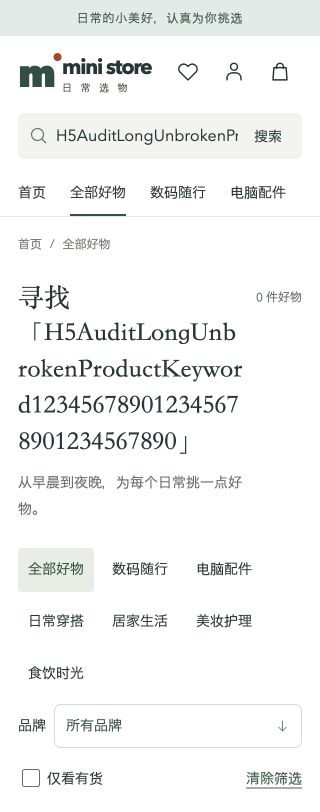
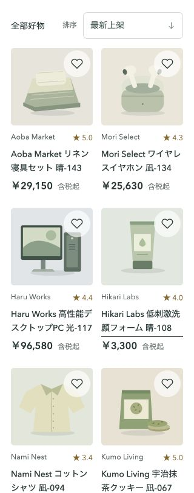
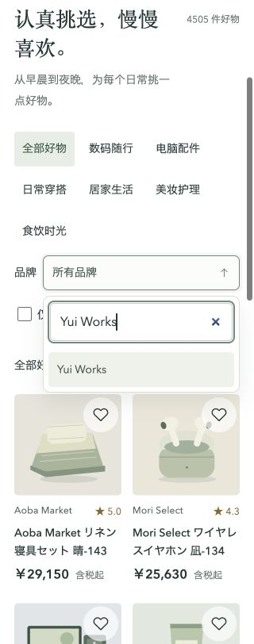
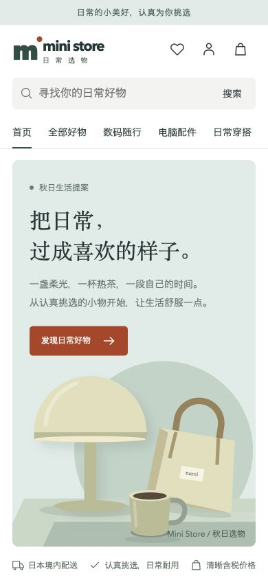
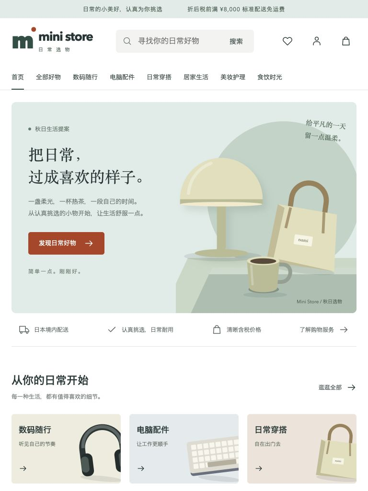
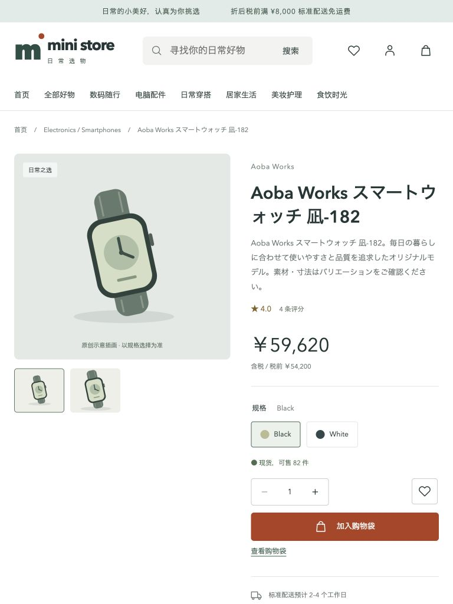

# H5 修复与复查

日期：2026-09-21。对应 [原始检查](README.md) 的 H5-01～H5-09。原报告和截图保留作修复前记录。

## 已修复

| 原问题 | 修复 | 浏览器结果 |
|---|---|---|
| H5-01、07 表单裁切与排列 | 共用表单使用可收缩 Grid，输入占满列，手机单列 | 320px 注册四个输入框均宽 244px、右边界 282px；16px 字号，完整显示 |
| H5-02 长搜索词 | 动态标题允许收缩和断词 | 同一长词在 320px 下页面宽与内容宽均为 320px |
| H5-03、04 分页 | 手机显示上一页／当前页与总页数／下一页；加载中禁用 | 下一页加载后焦点进入“商品查询结果”，结果栏距视口顶部约 20px |
| H5-05、06 字号与点击范围 | 商品名 14px、辅助信息至少 12px、表单 16px；高频图标按钮 44px | 320px 商品列表、390px 首页截图确认可读、无裁切 |
| H5-08 平板拥挤 | 761～1024px 首页三列商品，目录两列；标题调整；购买按钮独立一行 | 768px 首页标题无单字残行，加入购物袋按钮约 319×48px |
| H5-09 品牌查找 | 复用下拉组件增加可选搜索框 | 搜索 Yui Works 后正确选中、列表显示该品牌 31 件商品；空结果提示、Escape 返回触发器；普通排序可切换 |

另将空收藏的筛选控件隐藏；共用表单、购物袋、结算和弹窗补齐手机布局。保留既有搜索框焦点样式。

## 验证范围

- 首页、商品列表、商品详情：320 / 375 / 390 / 430 / 760 / 761 / 768 / 820 / 1024 / 1440px。
- 空收藏、购物袋未登录、结算未登录、帮助、登录：320 / 390 / 768 / 1024 / 1440px。
- 共 55 个页面与宽度组合，未发现整页横向溢出，见 [测量记录](after/viewport-measurements.json)。关键问题另以截图与实际交互验证，不能仅靠页面宽度判定。
- 9 项 Node 测试通过，包含新增品牌过滤与值对应检查；生产构建通过。浏览器本轮读取未见 warning/error。
- 没有新增依赖，没有注册账户、加购、提交订单或修改业务数据。

## 尚未覆盖

浏览器未登录：已登录购物袋、填写结算、订单、资料、地址与评价弹窗仅做源码及共用样式修复，尚未完成运行验收。当前验收为浏览器响应式模拟；iOS Safari、Android Chrome、微信 WebView、软键盘、真实触摸与系统字体放大仍需真机复查。

## 修复后截图

